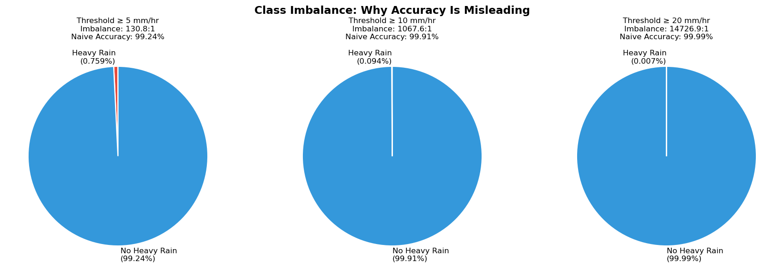
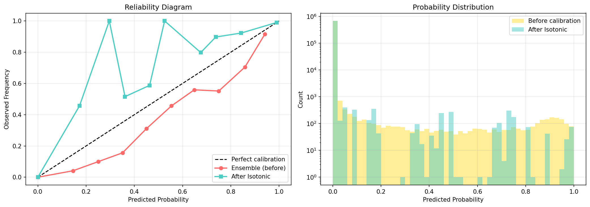
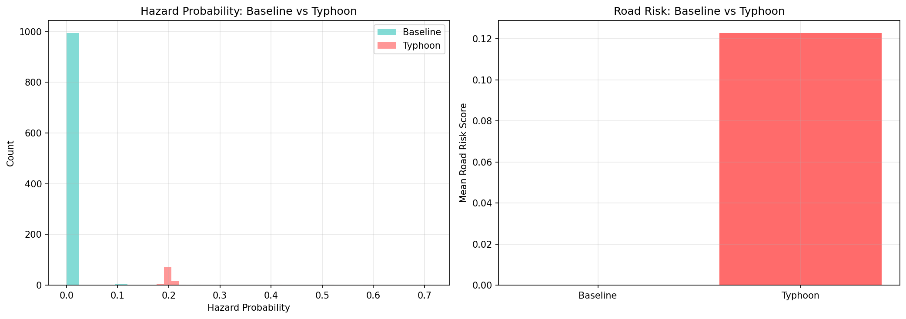

# Physics-Aware Rainfall Classification & Probabilistic Road Network Risk Pipeline

An end-to-end machine learning pipeline that forecasts **road network disruption risk** from ERA5 rainfall data. Uses a 30-model bootstrap Random Forest ensemble, spatial hazard-to-road mapping, and a full suite of research-grade validation including lead-time forecasting and baseline comparison.

**Study area:** Guangzhou metro area, Guangdong, China  
**Period:** June–August 2022 (East Asian Monsoon)  
**Hazard threshold:** ≥ 10 mm/hr (heavy rain)

---

## Pipeline Overview

```
ERA5 NetCDF  →  Feature Engineering (lag, rolling)
             →  Bootstrap RF Ensemble (30 models, 10mm threshold)
             →  Probability + Uncertainty per grid cell
             →  Spatial join → OSM Road Network (153K segments)
             →  Vulnerability Index (road type + betweenness centrality)
             →  Risk Score = Hazard × Vulnerability
             →  Phase 6: 9-component research validation
             →  Phase 7: LR baseline, lead-time forecasting, PR/Brier/reliability
             →  Streamlit Dashboard (8 pages)
```

---

## Results Gallery

### Model Comparison: Logistic Regression Baseline vs Ensemble RF


> The ensemble RF achieves **54% better CSI** and **69% lower Brier Score** than Logistic Regression, scientifically justifying the added model complexity.

---

### Lead-Time Forecasting: Performance Degradation Curve


> Clean, monotonic degradation validates that the model has **genuine predictive skill**, not just pattern-matching. POD drops from 0.93 (nowcast) to 0.60 (+60 min).

---

### Reliability Diagrams & Precision-Recall Curves

| Reliability (Calibration) | Precision-Recall |
|---|---|
|  |  |

> Reliability diagrams show how close predicted probabilities are to observed frequencies. PR curves are used instead of ROC for imbalanced data (0.09% positive rate).

---

### Brier Score Comparison


> Lower Brier Score = better probability calibration. The Ensemble RF (0h nowcast) achieves the best score.

---

### Class Imbalance Analysis



> With only 0.09% positive examples, accuracy reaches 99.91% by always predicting "no rain" — useless in practice. This plot proves why we use POD, CSI, and Brier Score.

---

### Phase 6 Validation: Typhoon Stress Test & Calibration

| Reliability Diagram | Typhoon Stress Test |
|---|---|
|  |  |

| Dynamic Scaling | Additional Metrics |
|---|---|
|  |  |

---

## How to Reproduce

### 1. Clone and create environment

```bash
git clone https://github.com/VishalSinha14/Physics-Aware-Rainfall-Classification-Probabilistic-Road-Network-Risk-Pipeline
cd Physics-Aware-Rainfall-Classification-Probabilistic-Road-Network-Risk-Pipeline

conda env create -f environment.yml
conda activate resilience_env
pip install streamlit-folium
```

### 2. Download ERA5 data

You need a free [CDS API key](https://cds.climate.copernicus.eu/). Set it up at `~/.cdsapirc`, then:

```bash
python src/download_era5_monthly.py   # downloads Jun–Aug 2022 NetCDF files
```

> The raw `.nc` files are ~800MB and not included in this repo.

### 3. Process ERA5 data

```bash
python src/process_era5.py            # converts NetCDF → CSV per month
python src/merge_monsoon_raw.py       # merges Jun/Jul/Aug CSVs
python src/add_temporal_monsoon.py    # adds lag/rolling features (~3.9M rows)
```

### 4. Download road network

```bash
python src/download_roads.py          # downloads OSM roads via OSMnx
```

### 5. Train the ensemble

```bash
python src/train_bootstrap_ensemble_10mm.py   # ~20–40 min on CPU
```

Trains 30 bootstrap RF models → saved to `models/bootstrap_models/`.

### 6. Run the risk model

```bash
python src/risk_model.py              # spatial join + vulnerability + risk scores
```

### 7. Run Phase 6 validation

```bash
python src/phase6_validation.py       # ~30 min, 9 validation components
```

### 8. Run Phase 7 research upgrades

```bash
python src/scientific/imbalance_analysis.py
python src/baselines/train_logistic_regression.py   # ~15 min, uses saga solver
python src/baselines/model_comparison.py
python src/leadtime/engineer_lead_labels.py
python src/leadtime/train_leadtime_models.py        # ~60 min, 30 models
python src/leadtime/evaluate_leadtime.py
python src/scientific/brier_analysis.py
python src/scientific/reliability_curves.py
python src/scientific/pr_curves.py
```

> **Windows note:** The LR script uses `saga` solver — do not change to `lbfgs` (crashes with heap corruption on 2.6M rows).

### 9. Launch the dashboard

```bash
streamlit run app/dashboard.py
```

Navigate to `http://localhost:8501` — 8 pages available in the sidebar.

---

## Project Structure

```
├── src/
│   ├── download_era5_monthly.py          # ERA5 data download
│   ├── process_era5.py / merge_monsoon_raw.py / add_temporal_monsoon.py
│   ├── train_bootstrap_ensemble_10mm.py  # 30-model RF ensemble
│   ├── download_roads.py                 # OSM road download
│   ├── risk_model.py                     # hazard × vulnerability → risk
│   ├── evaluation_metrics.py             # POD, FAR, CSI, Brier
│   ├── phase6_validation.py              # Phase 6: 9-component validation
│   ├── baselines/
│   │   ├── train_logistic_regression.py  # LR baseline model
│   │   └── model_comparison.py           # LR vs RF comparison
│   ├── leadtime/
│   │   ├── engineer_lead_labels.py       # 0h/30m/60m label shifts
│   │   ├── train_leadtime_models.py      # RF at each lead time
│   │   └── evaluate_leadtime.py          # degradation curve
│   └── scientific/
│       ├── imbalance_analysis.py         # why accuracy fails
│       ├── brier_analysis.py             # Brier Score comparison
│       ├── reliability_curves.py         # calibration diagrams
│       └── pr_curves.py                  # Precision-Recall curves
├── app/dashboard.py                      # Streamlit dashboard (8 pages)
├── data/
│   ├── raw/                              # ERA5 NetCDF (not in repo, ~800MB)
│   └── processed/                        # CSVs, GeoJSON (not in repo, large)
├── models/
│   ├── bootstrap_models/                 # 30 × Phase 3 RF (.pkl, not in repo)
│   └── leadtime/                         # 30 × lead-time RF (.pkl, not in repo)
├── results/
│   ├── phase6/                           # 9 validation plots + JSON metrics
│   ├── baselines/                        # LR results + comparison table
│   ├── leadtime/                         # degradation curve + metrics
│   └── scientific/                       # Brier, PR, reliability plots
├── docs/screenshots/                     # Result plots for README
├── environment.yml
└── main.py
```

---

## Phases & Key Results

### Phase 1–2: Data & Feature Engineering
- ERA5 variables: precipitation, 2m temperature, wind speed, soil moisture, surface pressure
- Temporal features: lag-1, lag-2, lag-3, 3h and 6h rolling sums
- 3.9M hourly samples, 1,785 grid points

### Phase 3: Hazard Classification
- 30 bootstrap RF models, 200 trees each, `class_weight='balanced'`
- ROC-AUC ≈ 0.9999, PR-AUC ≈ 0.886

### Phase 4: Road Network Risk
- 153,472 OSM road segments, 69K network nodes
- Risk = Hazard probability × Vulnerability (road type + betweenness centrality)

### Phase 5: Dashboard
8-page Streamlit dashboard: Overview, Risk Map, Metrics, Uncertainty, Phase 6 Validation, Model Comparison, Lead-Time, Data Explorer.

### Phase 6: Research-Grade Validation

| Component | Key Result |
|---|---|
| Time-based split (no leakage) | ROC-AUC=0.9996, CSI=0.58 |
| Calibration + reliability diagram | Brier Score=0.000853 |
| Typhoon stress test | 139× hazard amplification |
| Dynamic hazard scaling | 3.4% roads high-risk under 3× rainfall |
| Threshold sensitivity (5/10/20 mm) | CSI: 0.678 / 0.600 / 0.004 |
| Multi-threshold severity fusion | Three-tier graded risk output |
| Spatial cross-validation (16 blocks) | AUC=0.9993 ± 0.0009 |
| Monte Carlo vulnerability | Stable under ±20% perturbation |
| Ensemble diversity (RF vs GBM) | Mixed ensemble best Brier=0.00074 |

### Phase 7: Research Upgrades

**Baseline comparison**

| Model | POD | CSI | ROC-AUC | Brier Score |
|---|---|---|---|---|
| Logistic Regression | 1.000 | 0.385 | 0.9989 | 0.00369 |
| Ensemble RF (30 models) | 0.931 | 0.592 | 0.9995 | 0.00113 |

The ensemble RF has **54% better CSI** and **69% lower Brier** than LR — justifying complexity.

**Lead-time forecasting**

| Lead Time | POD | CSI | ROC-AUC |
|---|---|---|---|
| 0h (nowcast) | 0.931 | 0.592 | 0.9995 |
| +30 min | 0.731 | 0.279 | 0.9921 |
| +60 min | 0.599 | 0.180 | 0.9722 |

Smooth degradation = genuine predictive skill, not memorisation.

**Why not accuracy?** With 0.09% positive rate, "always predict no-rain" gives 99.91% accuracy but zero skill. We use POD, FAR, CSI, PR-AUC, and Brier Score.

---

## Technologies

| Layer | Tools |
|---|---|
| Data | ERA5 (CDS API), OpenStreetMap (OSMnx) |
| ML | scikit-learn (RF, LR, GBM, Isotonic calibration) |
| Geospatial | GeoPandas, Shapely, Folium |
| Network analysis | NetworkX |
| Dashboard | Streamlit, Plotly |
| Environment | Conda (Python 3.10) |

---

## License

Academic/research use only.