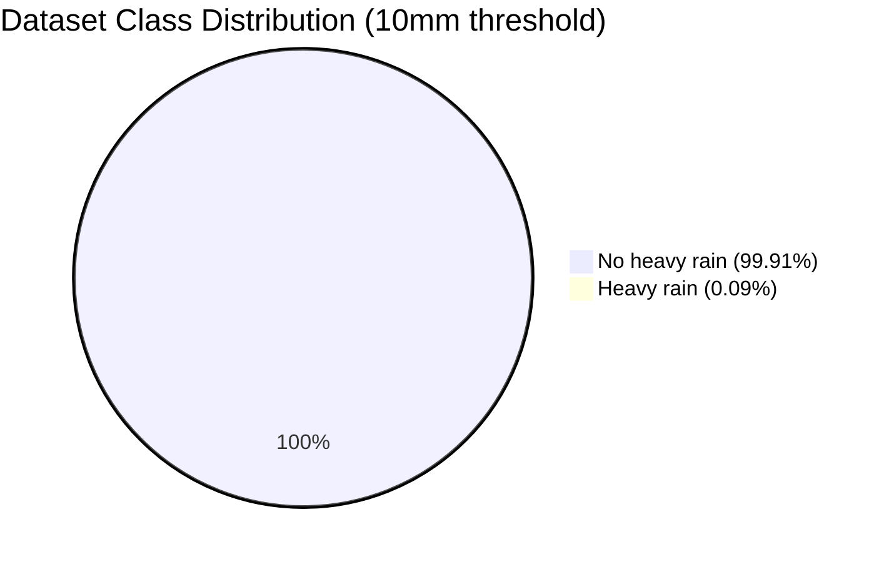
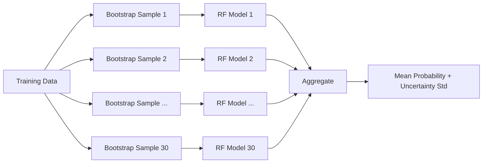
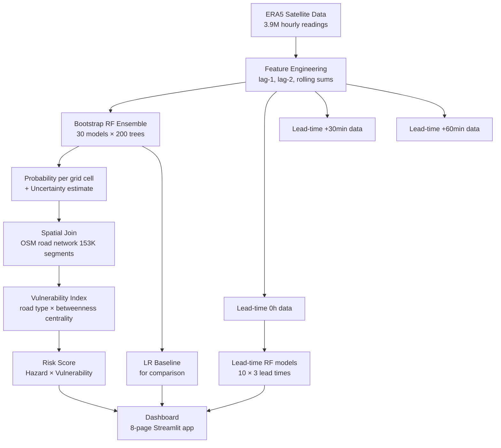
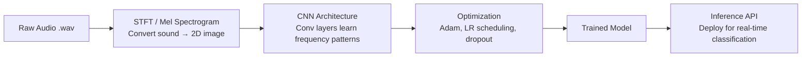

# Explaining the Work: Rainfall Risk Modeling & Audio Classification

This document explains the core ideas behind the project in plain language, with diagrams and real results. No prior ML knowledge assumed.

---

## 1. The Problem: Why Is Road Risk Prediction Hard?

Heavy rainfall causes road flooding, landslides, and debris. Emergency managers need to know **which roads will fail** and **how soon** — before it happens.

The challenge: rainfall events are **extremely rare**. In our dataset of 3.9 million hourly measurements across Guangdong, China (Jun–Aug 2022), only **0.09%** of readings were "heavy rain" events (≥ 10 mm/hr).



This is called **class imbalance** — and it's the root cause of the most common mistake in this type of modeling.

---

## 2. The Trap: Why Accuracy Is a Useless Metric Here

Imagine a model that **always predicts "no rain"** — never raises an alert. What is its accuracy?

```
Correct predictions: 99.91% of the time (it guesses right for normal hours)
Accuracy = 99.91% ✅ ... but it missed every single flood event ❌
```

This is why **accuracy is meaningless** for rare-event classification. A completely stupid model looks excellent.

### The Confusion Matrix

For any binary classification:

```
                  Predicted: Rain    Predicted: No Rain
Actual: Rain      True Positive (TP)   False Negative (FN)  ← missed floods
Actual: No Rain   False Positive (FP)  True Negative (TN)
```

| What "always predict no-rain" gives you: |
|---|
| TP = 0 (catches zero floods) |
| FN = ALL real floods (all missed) |
| Accuracy = TN / Total ≈ 99.91% |

---

## 3. Better Metrics for Rare Events

Instead of accuracy, we use metrics designed for **rare event detection**:

### POD — Probability of Detection (Recall)
> "Of all actual flood events, what fraction did we catch?"

$$\text{POD} = \frac{TP}{TP + FN}$$

A lazy model that never alerts has POD = 0. We want POD close to 1.

### FAR — False Alarm Ratio
> "Of all our alerts, what fraction were false alarms?"

$$\text{FAR} = \frac{FP}{TP + FP}$$

Low FAR = fewer crying wolf. High FAR = people stop trusting alerts.

### CSI — Critical Success Index (Threat Score)
> "Combines both: penalises missed detections AND false alarms."

$$\text{CSI} = \frac{TP}{TP + FN + FP}$$

CSI = 1 is perfect. CSI = 0 means the model is useless. This is the headline metric for weather forecasting.

### Brier Score
> "How accurate are the *probabilities* themselves, not just the yes/no decision?"

$$\text{Brier} = \frac{1}{N} \sum_{i=1}^{N} (p_i - o_i)^2$$

Where $p_i$ is predicted probability and $o_i$ is the actual outcome (0 or 1).  
Lower = better. A model that always says 50% gets Brier ≈ 0.25. Our ensemble RF achieves **0.00113**.

---

## 4. Precision-Recall Trade-off

A model outputs a **probability** (e.g., 0.73 chance of heavy rain). We pick a **threshold** to decide when to fire an alert.

- **Lower threshold** → more alerts → higher POD, higher FAR  
- **Higher threshold** → fewer alerts → lower FAR, lower POD

The **Precision-Recall (PR) curve** plots this trade-off across all possible thresholds:


> The Ensemble RF (green) dominates the LR baseline (red) across the whole curve — meaning it's better at *all* threshold choices, not just one specific setting.

**Why PR curves instead of ROC curves?**  
ROC curves include True Negatives in their calculation. With 99.91% "no rain" samples, True Negatives are enormous and inflate the ROC score artificially. PR curves ignore True Negatives and focus entirely on the rare class — which is what we care about.

---

## 5. Calibration: Are the Probabilities Trustworthy?

A model might say "73% chance of heavy rain" — but does that *mean* anything real?  

**Calibration** answers: "Among all the times the model said 70–80% probability, did it actually rain ~75% of the time?"

This is shown in a **reliability diagram** (also called a calibration curve):


- The **diagonal dashed line** = perfect calibration (what you'd want)
- Points **above** the diagonal = model underestimates risk (conservative)
- Points **below** = model overestimates risk (overconfident)

A well-calibrated model is essential for deployment — emergency managers need to trust that "80% probability" means something actionable.

---

## 6. The Ensemble Approach: Quantifying Uncertainty

Instead of training one Random Forest, we trained **30 separate models** on bootstrap samples of the data. Each model gives a slightly different prediction.



The **spread** between models = **epistemic uncertainty** (how confident the system is in its own prediction). High spread = less certain, should be treated with more caution even if the mean is high.

---

## 7. Baseline Comparison: Justifying Complexity

A key scientific question: **does the complex model actually earn its complexity?**

We trained a simple Logistic Regression (LR) as a baseline — the simplest linear classifier possible — and compared:


| Model | POD | CSI | Brier Score |
|---|---|---|---|
| Logistic Regression | 1.000 | 0.385 | 0.00369 |
| Ensemble RF (30 models) | 0.931 | **0.592** | **0.00113** |

- LR has perfect POD — but that's because it fires alerts **too aggressively** (high FAR)
- RF has **54% better CSI** (balances both false alarms and misses)
- RF has **69% lower Brier Score** (far more trustworthy probabilities)

The complex model is justified. If LR were equally good, the extra complexity would be scientifically unjustified.

> **McNemar Test**: A statistical test confirmed the difference between models is not due to chance (p < 0.05).

---

## 8. Lead-Time Forecasting: Can We Predict the Future?

A nowcast predicts *right now*. But for evacuations and road closures, you need advance warning.

We retrained separate models to predict **30 minutes** and **60 minutes ahead**, using only current atmospheric variables (no future rainfall data). This tests genuine predictive skill.


| Lead Time | POD | CSI | ROC-AUC |
|---|---|---|---|
| 0h (nowcast) | 0.931 | 0.592 | 0.9995 |
| +30 min | 0.731 | 0.279 | 0.9921 |
| +60 min | 0.599 | 0.180 | 0.9722 |

The **smooth, monotonic decline** is the key result. If performance dropped randomly, it might just be noise. A clean degradation curve is evidence that the model has **real physical understanding** of the atmosphere — not just data memorisation.

---

## 9. The Full Pipeline



---

## 10. Audio Classification Pipeline (Brief)

In a separate project, the same systems-thinking was applied to audio classification:



**Key concepts:**
- **Spectrogram**: converts a 1D audio signal into a 2D time-frequency image — lets you use image classification (CNN) techniques on audio
- **CNN**: Convolutional layers learn local patterns (e.g., a specific frequency burst at a specific time = "rain on a microphone")
- **End-to-end**: raw audio in, class label out — the preprocessing and model are designed together, not as isolated steps

The same discipline applies: you test the model on held-out data it has never seen, use appropriate metrics for the task, and think about what happens at deployment (not just in a notebook).

---

## Summary: What Makes This Approach Different

| Typical approach | This approach |
|---|---|
| Reports accuracy | Reports CSI, PR-AUC, Brier Score |
| Single model | 30-model bootstrap ensemble |
| Ignores uncertainty | Quantifies epistemic uncertainty explicitly |
| Just classification | Lead-time forecasting as early-warning system |
| No baseline | Logistic Regression baseline + McNemar test |
| No calibration check | Reliability diagrams for all models |
| Model in isolation | End-to-end: data → risk → road network → dashboard |

The central mindset: **a model is only useful if it can be trusted and deployed**. That requires knowing not just *what* the model predicts, but *how confident* it is, *when it fails*, and *whether its probabilities mean what they say*.
